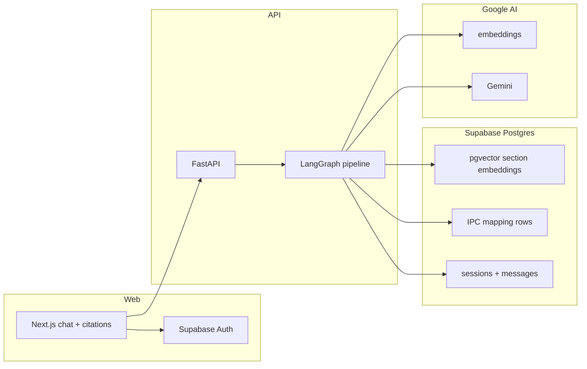

# Portfolio V1

LegalVault is a **resume-grade** agentic RAG demo: BNS-focused legal **research** (not advice) with citations, a deployed URL, and code you can explain in an interview.

Canonical decisions: [ADR-0015](./adr/0015-portfolio-v1-scope.md). Domain terms: [GLOSSARY.md](../GLOSSARY.md).

## What recruiters should try

1. Sign up with email on the live site.
2. Ask for a **BNS section** by number (section lookup).
3. Ask what happened to an **IPC section** (IPC→BNS mapping).
4. Describe a short **fact pattern** and ask which sections might apply—expect uncertainty when facts are thin.

Secondary modes (concept, comparison, general BNS) may work but are best-effort; copy should not overclaim.

## Architecture (V1)

**Pipeline nodes** (in-process): classify query mode → retrieve IPC mappings when needed → hybrid-retrieve BNS sections → compose research response → deterministic evidence verification.

## Stack

| Layer | Choice |
|-------|--------|
| UI | Next.js on Vercel |
| API | FastAPI + LangGraph on Railway/Fly (or similar) |
| Data | Supabase Postgres + pgvector |
| Models | Google Gemini + embedding model (see ADR-0010) |
| Local | `docker compose` for Postgres; API and web run on the host |

## In scope / out of scope

| In scope | Out of scope for V1 |
|----------|---------------------|
| BNS corpus + IPC mapping data | Case law, BNSS, BSA, non-Indian law |
| Citations grounded in retrieval | Autonomous legal action or advice |
| Short chat sessions | Long-term matter files |
| Basic confidence / refusal | Production-grade confidence calibration |
| Offline eval in CI (metrics) | Invite-gate as deploy blocker |
| Admin-only debug traces | User-facing trace UI |

## Evaluation

- CI: `uv run legalvault-eval` (in-process, fixture corpus)—report pass rate; do **not** use `--check-invite-gate` in CI.
- Before a big demo: `uv run legalvault-eval --check-invite-gate` locally or against staging.

See [eval-quality-gate.md](./eval-quality-gate.md).

Deploy steps: [deploy-portfolio.md](./deploy-portfolio.md).

## Optional follow-ups (not V1 blockers)

- One LangChain retrieval tool wired into the graph for explicit tool-calling demos.
- LLM faithfulness check on fact-pattern answers only.
- Stricter eval thresholds once the live corpus and prompts stabilize.
